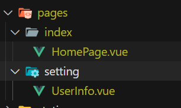
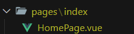
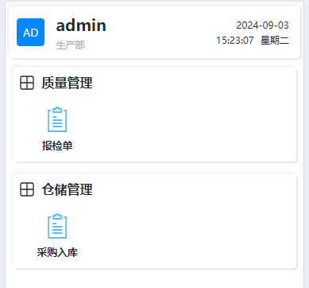

# 项目路由及文件初始化

## 脚本方式创建项目文件夹

此脚本会根据 `src/pages.json` 中的配置，自动生成相应的目录结构和默认代码。目前支持以下两种类型的文件创建。

### 1.通用目录结构与文件创建

例如，在 `pages.json` 中有以下配置：

```json
"pages": [
        {
            "path": "pages/index/HomePage",
            "style": {
                "navigationBarTitleText": "首页",
            }
        },
    	{
            "path": "pages/setting/UserInfo",
            "style": {
                "navigationBarTitleText": "设置",
            }
        }
]        
```

运行以下命令：

```
pnpm create-page
```

该脚本将自动在 `pages` 目录下创建 `index` 和 `setting` 文件夹，并分别生成 `HomePage.vue` 和 `UserInfo.vue` 文件。



默认代码结构为

```vue
<template>
    <view>首页</view>
</template>

<script setup lang="ts"></script>

<style scoped lang="scss"></style>

```

### 2. 根据高级配置创建目录结构与文件

如果在 `pages.json` 中有以下配置：

```
"pages": [
        {
            "path": "pages/index/HomePage",
            "style": {
                "navigationBarTitleText": "首页",
                "app-plus": {
                    "titleNView": {
                        "buttons": [{ "text": "新增", "fontSize": "15px", "color": "#1989fa" }]
                    }
                }
            }
        },
]      
```

脚本将创建包含以下代码结构的 `HomePage.vue` 文件：



创建的代码默认结构为

```vue
<template>
    <view>首页</view>
</template>

<script setup lang="ts">
import { onNavigationBarButtonTap } from '@dcloudio/uni-app';

onNavigationBarButtonTap(async ({ index }) => {
    if (index !== 0) {
        return;
    }
});
</script>

<style scoped lang="scss"></style>

```

## 脚本方式创建主页路由和文件夹

该操作同时包含上述步骤。

例如，在 `pages.json` 中有以下配置：

```json
"pages": [
        {
            "path": "pages/quality/ccc",
            "style": {
                "navigationBarTitleText": "cc"
            },
            "menu": {
                "modelLabel": "质量管理",
                "menuLabel": "报检单"
            }
        },
        {
            "path": "pages/quality/ccc",
            "style": {
                "navigationBarTitleText": "cc"
            },
            "menu": {
                "modelLabel": "仓储管理",
                "menuLabel": "采购入库"
            }
        },
]      
```

运行以下命令：

```
pnpm update-page
```

除了会分别创建文件夹外，还会根据menu的格式在`pages/index/useMenu.ts`分别会生成以下代码：

```ts
import { ref } from 'vue';

import { onLoad } from '@dcloudio/uni-app';

import { getUserInfo } from 'src/utils/user';

import type { MenuItem, SubMenuItem } from 'src/interface/interface';
export function useMenu() {
    const permissionList = ref<string[]>([]);

    // 路由数据
    const menuList = ref<MenuItem[]>([]);

    onLoad(() => {
        permissionList.value = getUserInfo()?.appPerms ?? [];
    });

    menuList.value = [
        {
            label: '质量管理',
            value: 'zhlgl',
            icon: 'radix-icons:component-2',
            subMenu: [
                {
                    label: '报检单',
                    value: 'bjd',
                    icon: 'x-mart-jilu',
                    path: '/pages/quality/ccc'
                }
            ]
        },
        {
            label: '仓储管理',
            value: 'cchgl',
            icon: 'radix-icons:component-2',
            subMenu: [
                {
                    label: '采购入库',
                    value: 'cgrk',
                    icon: 'x-mart-jilu',
                    path: '/pages/warehouse/aaa'
                }
            ]
        }
    ];

    /**
     * 权限配置
     */
    menuList.value = menuList.value
        .map((menu) => ({
            ...menu,
            subMenu: menu.subMenu.filter((sub) => {
                if (Array.isArray(sub.value)) {
                    return sub.value.some((val) => permissionList.value.includes(val));
                }
                return permissionList.value.includes(sub.value || menu.value);
            })
        }))
        .filter((menu) => menu.subMenu && menu.subMenu.length);

    /**
     * 导航至
     */
    function navigateTo(subMenu: SubMenuItem): void {
        uni.navigateTo({
            url: subMenu.path
        });
    }

    return {
        menuList,
        navigateTo
    };
}

```

自动生成主界面



同时会删除`pages`中带有menu字段的`json`配置

后续文件主界面的图标和路由须在`src/pages/index/useMenu`下进行维护


## 附录：

### 创建文件夹脚本：

```ts
import { existsSync, mkdirSync, readFileSync, writeFileSync } from 'fs';
import { resolve, dirname, basename } from 'path';

/**
 * 导航栏按钮配置
 */
interface NavBarButton {
    text: string;
    color?: string;
    fontSize?: string;
    iconPath?: string;
    iconClass?: string;
    iconSize?: string;
    iconColor?: string;
    action?: string;
}

/**
 * app导航栏配置
 */
interface AppNavBar {
    buttons?: NavBarButton[];
}

/**
 * AppPlus页面配置
 */
interface AppPlus {
    titleNView?: AppNavBar;
}

/**
 * 页面样式配置
 */
interface PageStyle {
    /**
     * 导航栏标题文字内容
     */
    navigationBarTitleText?: string;

    /**
     * app-plus页面配置
     */
    'app-plus'?: AppPlus;
}

/**
 * pages页面类型
 */
export interface PageType {
    path: string;
    style: PageStyle;
}


/**
 * 菜单
 */
export interface MenuItem {
    label: string;
    value: string;
    icon?: string;
    subMenu?: SubMenuItem[];
}

/**
 * 子菜单
 */
export interface SubMenuItem {
    label: string;
    value: string;
    icon: string;
    path: string;
}


const basePath = resolve(__dirname, '../../');

const packageJsonPath = resolve(basePath, 'src/pages.json');

const packageJson = JSON.parse(readFileSync(packageJsonPath, 'utf-8'));

const pages = packageJson.pages || [];

/**
 * 生成页面
 */
pages.forEach((page: PageType) => {
    const filePath = resolve(basePath, `src/${page.path}.vue`);

    if (!existsSync(filePath)) {
        const dir = dirname(filePath);

        if (!existsSync(dir)) {
            mkdirSync(dir, { recursive: true });
        }

        const componentName = page.style.navigationBarTitleText || basename(filePath, '.vue');
        let vueTemplate;

        if (page.style['app-plus']?.titleNView?.buttons) {
            vueTemplate = `<template>\n    <view>${componentName}</view>\n</template>\n\n<script setup lang="ts">\nimport { onNavigationBarButtonTap } from '@dcloudio/uni-app';\n\nonNavigationBarButtonTap(async ({ index }) => {\n    if (index !== 0) {\n        return;\n    }\n});\n</script>\n\n<style scoped lang="scss"></style>\n`;
        } else {
            vueTemplate = `<template>\n    <view>${componentName}</view>\n</template>\n\n<script setup lang="ts"></script>\n\n<style scoped lang="scss"></style>\n`;
        }

        writeFileSync(filePath, vueTemplate, 'utf-8');
    }
});

```

### 创建路由脚本:

```ts
import { readFileSync, writeFileSync } from 'fs';
import { omit } from 'lodash-es';
import { resolve,dirname } from 'path';
import { pinyin } from 'pinyin-pro'; 

/**
 * 导航栏按钮配置
 */
interface NavBarButton {
    text: string;
    color?: string;
    fontSize?: string;
    iconPath?: string;
    iconClass?: string;
    iconSize?: string;
    iconColor?: string;
    action?: string;
}

/**
 * app导航栏配置
 */
interface AppNavBar {
    buttons?: NavBarButton[];
}

/**
 * AppPlus页面配置
 */
interface AppPlus {
    titleNView?: AppNavBar;
}

/**
 * 页面样式配置
 */
interface PageStyle {
    /**
     * 导航栏标题文字内容
     */
    navigationBarTitleText?: string;

    /**
     * app-plus页面配置
     */
    'app-plus'?: AppPlus;
}

/**
 * 路由页面配置
 */
interface MenuPageConfig { 
    /**
     * 所属模块名字
     */
    modelLabel: string;
    /**
     * 路由名字
     */
    menuLabel: string;
}

/**
 * pages页面类型
 */
export interface PageType {
    path: string;
    style: PageStyle;
    menu?:MenuPageConfig
}


/**
 * 菜单
 */
export interface MenuItem {
    label?: string;
    value?: string;
    icon?: string;
    subMenu?: SubMenuItem[];
}

/**
 * 子菜单
 */
export interface SubMenuItem {
    label: string;
    value: string;
    icon: string;
    path: string;
}

const basePath = resolve(__dirname, '../../');

const packageJsonPath = resolve(basePath, 'src/pages.json');

const packageJson = JSON.parse(readFileSync(packageJsonPath, 'utf-8'));

/**
 * 获取页面配置
 */
const pages: PageType[] = packageJson.pages || [];

/**
 * 获取路由配置
 */
const menuPath = resolve(basePath, 'src/pages/index/useMenu.ts')

function readMenuListFromFile(filePath: string): MenuItem[] {
    const fileContent = readFileSync(filePath, 'utf-8');

    const regex = /menuList\.value\s*=\s*(\[\s*{[\s\S]*?}\s*\]);/;

    const match = fileContent.match(regex);

    if (match && match[1]) {
        const arrayString = match[1];

        const jsonArrayString = JSON.stringify(eval(arrayString));

        const menuList = JSON.parse(jsonArrayString);

        return menuList as MenuItem[];
    }

    return [];
}

/**
 * 生成拼音首字母的函数
 * @param str - 输入的中文或英文字符串
 * @returns - 拼音首字母或英文原文
 */
function generatePinyinValue(str: string): string {
    return pinyin(str, { pattern: 'initial', type: 'array' }).join('').toLowerCase();
}

// 生成新的菜单模块内容
const menuModules: Record<string,MenuItem> = {};

const newPage:PageType[] = [];

pages.forEach((page) => {
    if (page.menu) {
        const { modelLabel, menuLabel } = page.menu;
        const moduleKey = modelLabel;

      
        if (!menuModules[moduleKey]) {
            menuModules[moduleKey] = {
                label: modelLabel,
                value: generatePinyinValue(modelLabel),
                icon: 'radix-icons:component-2',
                subMenu: []
            };
        }

        menuModules[moduleKey].subMenu?.push({
            label: menuLabel,
            value: generatePinyinValue(menuLabel),
            icon: 'x-mart-jilu',
            path: `/${page.path}`
        });
        
        // 删除page中的menu属性
        page.menu = undefined
        newPage.push(page);
    } else { 
        newPage.push(page);
    }
});


/**
 * 将生成的模块内容转换为文本插入到useMenu中
 */
const newMenuContentString = `[${Object.values(menuModules)
    .map((menu) => `{
        "label": "${menu.label}",
        "value": "${menu.value}",
        "icon": "${menu.icon}",
        "subMenu": ${JSON.stringify(menu.subMenu, null, 4)}
    }`)
    .join(',\n')}]`;

const newMenuContent:MenuItem[] = JSON.parse(newMenuContentString);

const menuList = readMenuListFromFile(menuPath);

newMenuContent.forEach((newMenuItem) => {
    const existingMenuItem = menuList.find((menuItem) => menuItem.label === newMenuItem.label);

    if (existingMenuItem) {
        existingMenuItem.subMenu = existingMenuItem.subMenu || [];

        newMenuItem.subMenu?.forEach((subMenuItem) => {
            const existingSubMenuItem = existingMenuItem.subMenu?.find((item) => item.path === subMenuItem.path);

            if (!existingSubMenuItem) {
                existingMenuItem.subMenu?.push(subMenuItem);
            }
        });
    } else {
        menuList.push(newMenuItem);
    }
});


let useMenuFileContent = readFileSync(menuPath, 'utf-8');

const updatedMenuListString = JSON.stringify(menuList, null, 4);
useMenuFileContent = useMenuFileContent.replace(
    /menuList\.value\s*=\s*\[[\s\S]*?\];/,
    `menuList.value = ${updatedMenuListString};`
);

writeFileSync(menuPath, useMenuFileContent, 'utf-8');

/**
 * 删除原有的pages.json中的menu文件
 */
packageJson.pages = newPage;
writeFileSync(packageJsonPath, JSON.stringify(packageJson, null, 4), 'utf-8');


```

